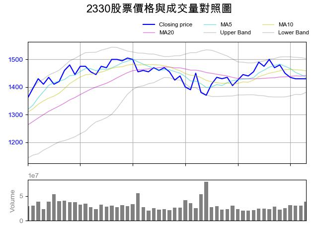

# 股票分析與聊天機器人整合

這是一個使用 **Python Flask** 架構的聊天機器人專案，結合 Yahoo Finance 資料與技術分析圖表，支援股票查詢、均線和布林通道繪圖等功能。

## 🔧 功能特色

- 抓取股市資料（如台積電 2330.TW）
- 自動繪製布林通道與均線圖表

## 📁 專案結構

- `Flask.py`：主程式入口，處理 webhook 與回覆邏輯
- `quickTourButton.json`： 按鈕範本
- `.gitignore`：忽略敏感與暫存檔案

## 🚀 使用教學（LINE Bot）

1. 在 LINE Developers 建立 Messaging API Channel  
2. 將 Channel Access Token 與 Secret 放入 `.env` 
3. 部署 Flask 伺服器（Heroku / Render / 自架伺服器皆可）
4. 設定 Webhook URL 指向你的 Flask 伺服器
5. 使用者快速導覽，系統跳出按鈕方塊供使用者使用

## 📊 範例截圖

以下為布林通道與均線圖表範例：

## 🚫 注意事項

請勿將 `.env` 檔案或 API 金鑰加入版本控制。已透過 `.gitignore` 保護。
建議公開前檢查程式碼是否有敏感資訊。

## 📜 授權

本專案為私人用途，未開放授權。

MIT License

Copyright (c) 2025 陳廷茂

Permission is hereby granted, free of charge, to any person obtaining a copy
of this software and associated documentation files (the "Software"), to deal
in the Software without restriction, including without limitation the rights
to use, copy, modify, merge, publish, distribute, sublicense, and/or sell
copies of the Software, and to permit persons to whom the Software is
furnished to do so, subject to the following conditions:

The above copyright notice and this permission notice shall be included in
all copies or substantial portions of the Software.

THE SOFTWARE IS PROVIDED "AS IS", WITHOUT WARRANTY OF ANY KIND, EXPRESS OR
IMPLIED, INCLUDING BUT NOT LIMITED TO THE WARRANTIES OF MERCHANTABILITY,
FITNESS FOR A PARTICULAR PURPOSE AND NONINFRINGEMENT. IN NO EVENT SHALL THE
AUTHORS OR COPYRIGHT HOLDERS BE LIABLE FOR ANY CLAIM, DAMAGES OR OTHER
LIABILITY, WHETHER IN AN ACTION OF CONTRACT, TORT OR OTHERWISE, ARISING FROM,
OUT OF OR IN CONNECTION WITH THE SOFTWARE OR THE USE OR OTHER DEALINGS IN
THE SOFTWARE.
